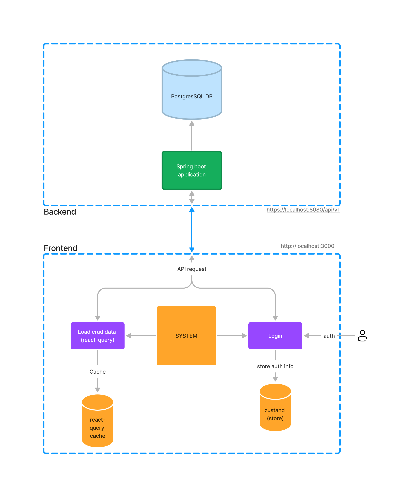
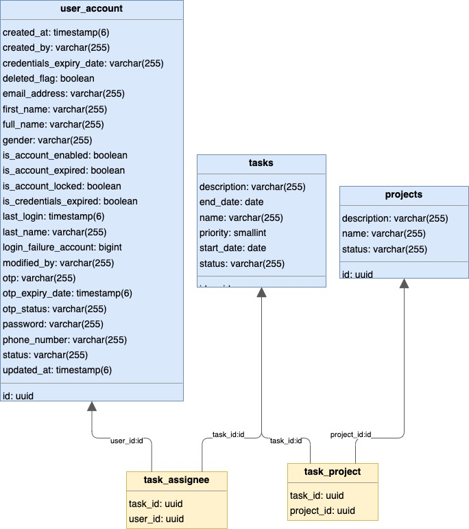

# Task Management System

## Description

This is a simple task management system that allows you to create, edit, and delete tasks. It also allows you to mark tasks as complete and incomplete. The tasks are stored in a database and are displayed in a table. The table can be sorted by any of the columns. The tasks can also be filtered by the status of the task.

## Architecture

## ERD

## Documentation

- [Backend](qt-mis-backend/README.md)
- [Frontend](qt-mis-frontend/README.md)

